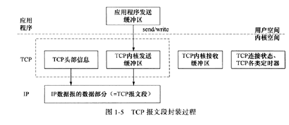
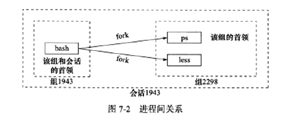

[TOC]


### 实验1-判断字节序

#### 基本

- 字节序：基本数据类型字节的排序。意思明了，区分于“位序”
- 主机字节序：现代PC多使用little endian，所以小端字节序也被称为主机字节序
- 网路字节序：网络传输通常使用big endian（JVM也用big endian）
- 转换函数：`htonl(unsigned long int)`和`ntohl(unsigned long int)`（`htons(unsigned short int)`和`ntohs(unsigned short int)`）


#### 代码

`endian_test.cc`

- 注1：关键在于使用union


### 实验2-设置backlog参数

#### 基本

- backlog：`listen(int, int)`中的参数，设置socket中处于ESTABLISHED状态的连接的上限。处于半连接（SYN_RCVD）的上限由参数`/proc/sys/net/ipv4/tcp_max_syn_backlog`决定.


#### 代码

- 接收方：`backlog_test.cc`


#### <span style="color:red">思考题</span>

##### Q1：能否直接在`backlog_test.cc`基础上监听80端口？

- 尝试1：创建socket会失败，可能是因为IANA规定了80端口为www服务（见`/etc/service`），需要特殊操作才能监听？


### 实验3-收发OOB数据

#### 基本

- TCP数据读写：

  - `recv(int, void*, size_t, int)`
  - `send(int, const void*, size_t, int)`
  - 其中`recv`将内核空间字节流写入`void*`，`send`将用户空间数据`const void*`写入内核空间字节流

  

- UDP数据读写：

  - `recvfrom(int, void*, size_t, int, struct sockaddr*, socklen_t)`
  - `sendto(int, const void*, size_t, int, struct sockaddr*, socklen_t)`
  - 相比TCP，需要指明对方socket地址。设置为NULL时也可以用于面向连接（STREAM）的socket数据读写。（阅读man）


#### 代码

- 接收方（如服务器）：`oob_recv_test.cc`
- 发送方（如客户端）：`oob_send_test.cc`


#### <span style="color:red">思考题</span>

##### Q1：UDP一定不能面向连接？UDP面向连接后跟TCP有什么区别？


##### Q2：当前代码有bug

描述：有时接收端接收MSG_OOB会有invalid argument，但抓包时几乎不会碰到。（启动前，已经`netstat -nat`确认端口未被占用&之前的连接已结TIME_WAIT）


##### Q5：数据流存在于多个buf中时怎么收发？

描述：比如HTTP报文中，响应头在一个buf，返回的文件在另一个buf，如何将二者写入到peer_sock？

- 方案1：拼接成连续的再用`send()`系统调用（接收类似）
  - 不足：带来不必要的遍历
- 方案2：使用集中写`writev(int, const struct iovec* vec, int )`，将`vec`中指向的分段连续数据通过一个系统调用写入（接收类似，有`readv()`分散读）。代码见实验5-体验零拷贝
  - 不足：需要在用户缓冲区和内核缓冲区间传递数据（未确认）


### 实验4-用dup实现echo（CGI style）

#### 基本

- Unix中万物皆file descriptor
- 什么是CGI
  - Common Gateway Interface，服务器提供的对外API，程序通常放在cgi-bin/下。服务器接收到请求后，通常新建进程、处理、结果直接输出到客户端（就像重定向了，比如直接输出html到浏览器）
  - https://www.quora.com/What-is-the-difference-between-CGI-programming-and-the-REST-Api-Is-CGI-programming-a-way-of-implementing-the-REST-API
  - https://en.wikipedia.org/wiki/Common_Gateway_Interface
- `int dup(int file_descriptor)`行为：为`file_descriptor`创建一个系统当前可用的最小文件描述符，与`file_descriptor`**指向同一个文件（文件引用+1）**。


#### 代码

- 接收端：`echo_dup.cc`
- 发送端：`telnet <server_ip> <port>`


#### <span style="color:red">思考题</span>

##### 	Q1：服务端输出到`peer_sockfd`的信息为什么不会被telnet再次传过来？

描述：不难理解用`dup(peer_sockfd)`将服务端STDOUT重定向到`peer_sockfd`指向的文件，可以实现服务端直接printf到客户端。但为什么此时还可以通过`recv(peer_sockfd, ...)`从同一个文件（`peer_sockfd`指向的文件）读取到输入，却不读取服务端printf的内容？

- 猜测1：服务端输出（STDOUT）和接收（`recv()`）都指向`peer_sockfd`，但`peer_sockfd`是SOCK_STREAM类型，收发缓冲分离。telnet从客户端STDIN(0)读取，给到`peer_sockfd`发送缓冲；服务端STDOUT写入到`peer_sockfd`接收缓冲，telnet读取后给到STDOUT(1)。
  - STDOUT和STDIN的fd不同，它俩是不是指向同一个文件？为什么都能回显到屏幕？https://stackoverflow.com/questions/40755048/why-are-stdin-and-stdout-seemingly-interchangeable


##### Q2：`dup()`+`printf()`能否取代`send()`？

描述：既然`dup()`+`printf()`能在服务端实现`send()`，那它俩能不能取代客户端的`send()`发送数据？


##### Q3：UDP能不能用`dup()`+`printf()`实现CGI？

描述：`echo_dup.cc`中`dup()`+`printf()`在`accept()`之后，能不能创建socket后直接`dup()`+`printf()`？即能否UDP方式写一个echo_dup？


### 实验5-体验零拷贝

#### 基本

- 从实验3中得知，socket的`read()`和`send()`会触发内核缓冲区和用户缓冲区的数据拷贝，可能会降低效率（未测试）
- 零拷贝：**文件描述符间**（其实很通用，因万物皆文件）直接在内核空间传递数据。经典的有
  - 从支持mmap的文件到socket：`ssize_t sendfile(int out_fd, int in_fd, off_t* offset, size_t count)`（man告诉我，Linux 2.6.33后，`out_fd`支持任何文件）
  - 从管道到非管道（或反之）：`ssize_t splice(int fd_in, loff_t* off_in, int fd_out, loff_t* off_out, size_t len, unsigned int flags)`
  - 从管道到管道：`ssize_t tee(int fd_in, int fd_out, size_t len, unsigned int flags)`


#### 代码

- 发送端：`sendfile_service.cc`
- 接收端：`telnet <server_ip> <service_port>`


#### <span style="color:red">思考题</span>

##### Q1：telnet获取的文件是回显到stdout的，有无对任意端口类似wget的工具？

描述：期望接收方能像wget一样获取发送端的文件资源

- 尝试1：`man wget`，发现wget仅支持HTTP和FTP，SEE ALSO中也无其他命令。


##### Q2：如何对比`sendfile()`和`send()的效率？


### 实验6-用splice实现echo（零拷贝）

#### 基本

- 对比实验4
- 基本思路：用管道作边，让`peer_socket`形成自环


#### 代码

- 接收端：`echo_splice.cc`

- 发送端：`telnet <server_ip> <service_port>`


#### <span style="color:red">思考题</span>

##### Q1：`splice()`是阻塞的吗？`pipefd`是阻塞的吗？`peer_sockfd`是阻塞的吗？


##### Q2：非阻塞socket有什么需要注意的？


##### Q3：当前`echo_splice`和`echo_dup`只是accept一次，然后死循环。如何处理客户端重连的情况？


### 实验7-体验守护进程

#### 基本

- 进程的各种ID：

  - 对进程本身：Linux下每个进程都有真实用户ID（UID）和真实组ID（GID），还有有效用户ID（EUID）和有效组ID（EGID）。“有效”的目的是方便资源访问——对设置了`set-user-id`标志位的文件，其他用户运行该程序时，可以以文件所有者身份运行。
  - 对进程本身：Linux下每个进程有进程ID（PID）、父进程ID（PPID），且都隶属于一个进程组（PGID）。
  - 对进程组：关联的进程组会形成一个会话（SID），SID等于会话首领（调用`setsid()`系统调用的进程）**所在进程组**的进程组ID（PGID）。

- 举例

  ```shell
  divsigma@tom:~/simple-server/examples$ ps -o euid,pid,ppid,pgid,sid,comm | cat
   EUID     PID    PPID    PGID     SID COMMAND
   1000    1168    1164    1168    1168 bash
   1000    3807    1168    3807    1168 ps
   1000    3808    1168    3807    1168 cat
  ```

  

- 


#### 代码

- 服务端：`daemo_echo_splice.cc`
- 发送端：`telnet <server_ip> <service_port>`


#### <span style="color:red">思考题</span>

##### Q1：Linux中SID是否通过并查集实现？

