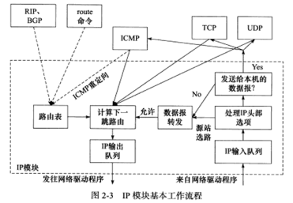
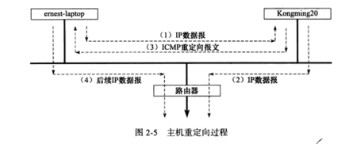
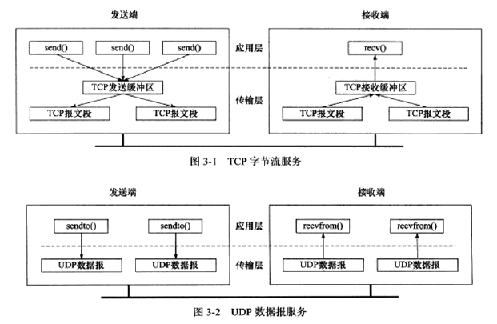
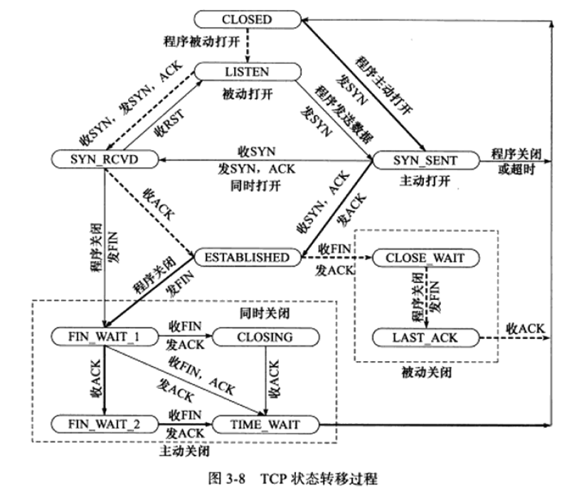
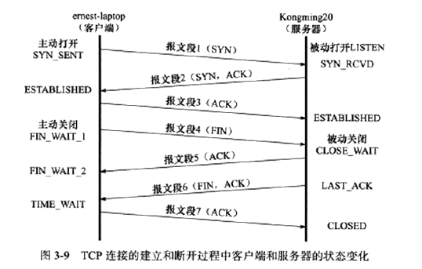
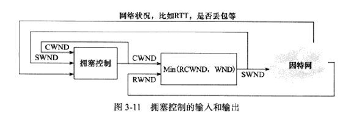
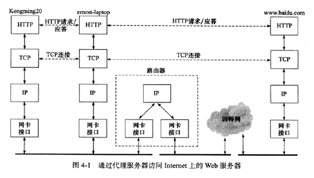
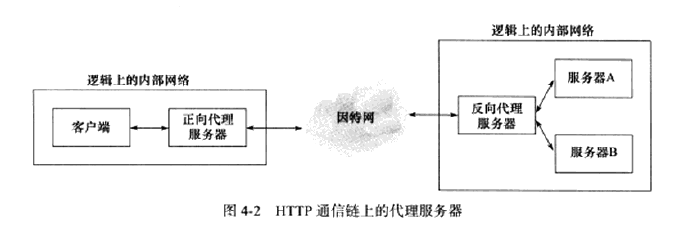

[TOC]


### 1. MAC层：使用ARP将ip翻译为MAC

#### 基本

- `arp -a`：操作ARP高速缓存信息。指定网卡（-i）添加（-s）、删除（-d）
- `tcpdump -i eth0 -ent '(dst 10.0.8.14 and src 10.0.8.13)or(dst 10.0.8.13 and src 10.0.8.14)'`：显示符合过滤条件的网络包（**本质是以太网帧？**）。指定网卡（-i），不带主机名（-n）、不带时间戳（-t）地查看包含以太网帧头（-e）信息（如MAC地址）的TCP/IP包，`[expression]`为过滤信息。
  - Wireshark是否就是一个tcpdump而已？
  - 以太网帧头部0x0800为IP报文、0x0806为ARP报文（如果ARP Cache有entry则不产生该报文）
  - Request中ff:ff:ff:ff:ff:ff是广播地址，只有符合查询的IP机器才Reply，返回对应的MAC


#### 实验1--用tcpdump查看link-layer信息

```shell
ubuntu@VM-8-13-ubuntu:~$ sudo tcpdump -ent '(dst 10.0.8.14 and src 10.0.8.13)or(dst 10.0.8.13 and src 10.0.8.14)'
tcpdump: verbose output suppressed, use -v or -vv for full protocol decode
listening on eth0, link-type EN10MB (Ethernet), capture size 262144 bytes
52:54:00:c6:19:6e > ff:ff:ff:ff:ff:ff, ethertype ARP (0x0806), length 42: Request who-has 10.0.8.14 tell 10.0.8.13, length 28
fe:ee:30:30:20:26 > 52:54:00:c6:19:6e, ethertype ARP (0x0806), length 42: Reply 10.0.8.14 is-at fe:ee:30:30:20:26, length 28
```

- 注1：需要sudo获取对序号最小网卡eth0的tcpdump权限，否则

```shell
tcpdump: eth0: You don't have permission to capture on that device
(socket: Operation not permitted)
```


#### <span style="color:red">思考题</span>

- `arp -a`第一个entry能删除吗？
- 为什么`telnet 10.0.8.x`后，arp新增的MAC地址都同第一个entry的MAC？
- 为什么`ifconfig -a`看不见公网ip的网卡？
- 为什么直接`telnet <公网ip>`，arp缓存没有新增？（如何tcpdump看）


### 2. DNS：/etc/resolve.conf文件与host的使用

#### 基本

- `/etc/resolve.conf`有四种管理方式，`man systemd-resolved.service`中推荐的是该文件作为到systemd-resolve的操作文件——`/run/systemd/resolve/stub-resolv.conf`——的软连接，其中仅列出一个本地DNS stub listener（一般为127.0.0.53），方便使用DNS服务的程序通过该地址连接到systemd-resolve（相当于代理？）
- `systemd-resolve --status`
  - 查询真正在使用的DNS Sever信息（而非DNS stub listener）
- `host -t A www.baidu.com`
  - DNS支持查询host的多种信息，A Record是最简单的一种，返回host的hostname和ipv4。https://ns1.com/resources/dns-types-records-servers-and-queries
  - DNS报文可以发送TCP（一般默认是UDP，对特殊类型默认发送TCP如AXFR）


#### 实验2--分析host包

```shell
ubuntu@VM-8-13-ubuntu:~$ sudo tcpdump -nt -s 500 port domain
tcpdump: verbose output suppressed, use -v or -vv for full protocol decode
listening on eth0, link-type EN10MB (Ethernet), capture size 500 bytes
IP 10.0.8.13.52717 > 183.60.83.19.53: 44166+ A? www.baidu.com. (31)
IP 183.60.83.19.53 > 10.0.8.13.52717: 44166 3/0/0 CNAME www.a.shifen.com., A 14.215.177.38, A 14.215.177.39 (90)

ubuntu@VM-8-13-ubuntu:~$ host -t A www.baidu.com
www.baidu.com is an alias for www.a.shifen.com.
www.a.shifen.com has address 14.215.177.39
www.a.shifen.com has address 14.215.177.38
```

- 注1：tcpdump报文中，`IP`表示IP报文，IP地址最后一个小数点后为端口号，所以可知DNS服务器使用`53`端口。`+`代表递归查找。`A?`代表A类型Query报文。其余细节信息可以对比报文头以及字节序得出。

- 注2：`183.60.83.19`是`systemd-resolve --status`的DNS Servers中有列出的服务器地址。


#### <span style="color:red">思考题</span>

- 如何查看本地DNS Cache？
- 为什么抓不到host-->DNS Stub listener的数据包？


### 3. IP层报文：理解IPv4报文头及其分片

#### 基本

- IPv4报文头结构：（1）版本号、头部32位字长、总长；（2）标志和FLAGS；（3）TTL和协议；（4）源IP；（5）目标IP；（6）选项（最多40B）。IP固定首部共5行32位字、共20B。
- IP层是best-effort，可靠性由上层保证。由此可知，IP层及其下层都是best-effort，MAC层和IP层只保证数据的无差错。
- `tcpdump -ntx -i lo icmp` 
  - `-x`参数会以hex显示tcpdump包数据部分，从0x0开始对应IP报头部，可见tcpdump抓取的是以太网帧。
  - `icmp`表示过滤规则，只抓取ICMP报文
- `ping localhost -s 1473`
  - ICMP Ping报文可以设置长度，因网卡MTU=1500B，IP头=20B，ICMP头=8B，所以1473+20+8=1501会被分片，前一片的以太网帧数据段1500B=20B+(8B+1472B)，后一片的以太网帧数据段21B=20B+(1B)（注意第二段不用ICMP头了，对IP层而言，ICMP就是一段8B+1473B=1481B的数据）
  - ICMP报文被归类为IP层协议（为什么？），但它使用了IP层的服务（一般来说上层使用下层服务），看起来像是IP层的上层协议（因为会被封装为IP报）。


#### 实验1--分析ping包

```shell
ubuntu@VM-8-13-ubuntu:~$ ping localhost -s 65509
Error: packet size 65509 is too large. Maximum is 65507

ubuntu@VM-8-13-ubuntu:~$ ping localhost -s 1473
ubuntu@VM-8-13-ubuntu:~$ sudo tcpdump -i lo -ntv icmp
tcpdump: listening on lo, link-type EN10MB (Ethernet), capture size 262144 bytes
IP (tos 0x0, ttl 64, id 39075, offset 0, flags [DF], proto ICMP (1), length 1501)
    127.0.0.1 > 127.0.0.1: ICMP echo request, id 13477, seq 1, length 1481
IP (tos 0x0, ttl 64, id 39076, offset 0, flags [none], proto ICMP (1), length 1501)
    127.0.0.1 > 127.0.0.1: ICMP echo reply, id 13477, seq 1, length 1481
```

- 注1：利用`-v`选项显示部分解析的IP头部信息，利用`-e`显示获取link-layer信息。


#### 实验2--分析telnet包

```shell
ubuntu@VM-8-13-ubuntu:~$ telnet localhost

ubuntu@VM-8-13-ubuntu:~$ sudo tcpdump -ntxv -i lo tcp
tcpdump: listening on lo, link-type EN10MB (Ethernet), capture size 262144 bytes
IP (tos 0x10, ttl 64, id 60534, offset 0, flags [DF], proto TCP (6), length 60)
    127.0.0.1.58032 > 127.0.0.1.23: Flags [S], cksum 0xfe30 (incorrect -> 0xb29b), seq 2150661254, win 49188, options [mss 16396,sackOK,TS val 2681478546 ecr 0,nop,wscale 7], length 0
        0x0000:  4510 003c ec76 4000 4006 5033 7f00 0001
        0x0010:  7f00 0001 e2b0 0017 8030 7c86 0000 0000
        0x0020:  a002 c024 fe30 0000 0204 400c 0402 080a
        0x0030:  9fd4 1d92 0000 0000 0103 0307
```

- 注1：模拟计算机走一遍解析，就知道开头0x45的重要性。0x4是版本号，指明剩余的头部如何解析，相当于一级目录；对ipv4，0x5是头部的32位字大小，用于标记IP头终止位置。由此可知，0x0000~0x0013就是IP所有头部信息，0x0014开始就是上层协议的内容（即IP数据段内容）。从后面实验可知，这里0xe2b0==58032D，是TCP的源端口号。


#### <span style="color:red">思考题</span>

- 如何确认tcpdump抓取的是以太网帧？`-x`能不能从IP帧以上（如TCP帧）开始解析？
- 为什么TCP不像IP，把协议版本号和头部长度放在最开始？而是把头部长度放在端口号、序号、确认号之后？
- eth0的inet是10.0.8.13，为什么`tcpdump -i eth0 -ntv icmp`会有下述ICMP，却没有`ping 10.0.8.13 -s 1473`产生的ICMP？

```shell
IP (tos 0x0, ttl 255, id 22172, offset 0, flags [none], proto ICMP (1), length 28)
    169.254.128.17 > 10.0.8.13: ICMP echo request, id 37544, seq 25812, length 8
```

- 为什么`tcpdump -i lo -ntv icmp`后，`ping 10.0.8.13 -s 1473`也会产生下述包信息？

```shell
IP (tos 0x0, ttl 64, id 39075, offset 0, flags [DF], proto ICMP (1), length 1501)
    127.0.0.1 > 127.0.0.1: ICMP echo request, id 13477, seq 1, length 1481
IP (tos 0x0, ttl 64, id 39076, offset 0, flags [none], proto ICMP (1), length 1501)
    127.0.0.1 > 127.0.0.1: ICMP echo reply, id 13477, seq 1, length 1481
```

- 


### 4. IP层路由：主机可以作为网关，对路由重定向

#### 基本

- `route add -host <host_ip> dev <If>`
  - IP路由机制：查找顺序是——（1）先按主机IP匹配entry，有则转发，否则（2）按网络IP匹配entry，有则转发，否则（3）选择名为default的entry，即默认路由，一般是网关。网关是在IP层连接各个LAN的接口。
  - IP模块工作流程：
  
  
  
  - route命令用于操作IP路由表和路由表缓存（`route -Cn`查看路由表缓存），`-host`参数可以在路由表中为该主机ip添加路由项，这样IP的路由机制会之间通过`<If>`发送目的地是`<host_ip>`的数据包
  - 一般来说，主机没有开启IP报的转发功能，该功能由内核参数`/proc/sys/net/ipv4/ip_forward`控制。
- /proc/sys/net/ipv4/conf/all/send_redirects和/proc/sys/net/ipv4/conf/all/accept_redirects
  - 两个内核参数分别控制主机能否发送和接收ICMP重定向报文。ICMP重定向报文常用于更新路由表**缓存**
  - 一般来说，主机只能accept，路由器只能send

#### 实验1--查看路由表

```shell
ubuntu@VM-8-13-ubuntu:~$ route
Kernel IP routing table
Destination     Gateway         Genmask         Flags Metric Ref    Use Iface
default         _gateway        0.0.0.0         UG    100    0        0 eth0
10.0.8.0        0.0.0.0         255.255.252.0   U     0      0        0 eth0
```

- 注1：`man route`看释义。


#### 实验2--主机网关重定向路由

```

```

（在A上使用route add和route del修改路由表，添加B主机为默认网关；在A上ping外网，应该可以看到来自B的重定向icmp）

- 注1：大致过程。注意网关主机会负责转发第一个IP报。



- 


#### <span style="color:red">思考题</span>

- 如何模拟实验2
- `_gateway`变量是啥？（arp查看ARP缓存时也有）
- IP模块的IP转发子模块何时决定给源端重定向？


### 5. TCP/UDP层报文：理解TCP头部

#### 基本

- TCP三特点：**面向连接**，向上提供**可靠**的**字节流**服务。

  - 面向连接：双发传输数据需要内核资源，传输完毕需要释放资源（像维护一个session）
  - 面向字节流：TCP收发缓存被读写api及报文段复用，send()和recv()次数与TCP报文段个数非对等。这里是指提供面向字节流的服务，TCP的传输还是面向数据报的（吗？）
  - 可靠传输：所有TCP报文段需要有应答确认。TCP层会负责报文段的重传、重排、整理，向上提供可靠的字节流服务。

  

- TCP头部结构：

  - 固定头部：（1）源端口、目的端口；（2）报文段首位字节的字节序号；（3）确认号；（4）32位字头部长度、标志位、窗口大小；（5）校验和、紧急指针。共5个32位字。
  - 选项头部：典型结构为kind+length+info。比如MSS、窗口扩大因子、SACK机制开启与否、时间戳等，都可以通过选项头部指定。类似IP转发功能，这些选项由内核参数控制，如/proc/sys/net/ipv4/tcp_window_scaling、/proc/sys/net/ipv4/tcp_sack、/proc/sys/net/ipv4/tcp_timestamps。这些选项通常用于SYN报文，用于沟通本次TCP链接的参数。


#### 实验1--分析telnet包

```shell
ubuntu@VM-8-13-ubuntu:~$ telnet localhost

ubuntu@VM-8-13-ubuntu:~$ sudo tcpdump -ntxv -i lo tcp
tcpdump: listening on lo, link-type EN10MB (Ethernet), capture size 262144 bytes
IP (tos 0x10, ttl 64, id 60534, offset 0, flags [DF], proto TCP (6), length 60)
    127.0.0.1.58032 > 127.0.0.1.23: Flags [S], cksum 0xfe30 (incorrect -> 0xb29b), seq 2150661254, win 49188, options [mss 16396,sackOK,TS val 2681478546 ecr 0,nop,wscale 7], length 0
        0x0000:  4510 003c ec76 4000 4006 5033 7f00 0001
        0x0010:  7f00 0001 e2b0 0017 8030 7c86 0000 0000
        0x0020:  a002 c024 fe30 0000 0204 400c 0402 080a
        0x0030:  9fd4 1d92 0000 0000 0103 0307
```

- 注1：从之前tcpdump抓取IP报分析头部的实验中知道，0x0014开始是TCP报文段信息。可以看到该报文`Flags [S]`代表SYN报文（`options`中`MSS`和`wscale`只出现在SYN报文）。


### 6. TCP/UDP层状态机：理解TCP连接的建立和关闭

#### 基本

- 建立TCP连接：三次握手
  - 为什么不能一次或二次：TCP是面向连接的、连接是全双工的，需要保证收发的双向建立
- 关闭TCP连接：四次挥手
  - 为什么能三次：可以三次，取决于TCP的延迟确认特性。但至少要三次，要保证双向关闭。TCP延迟特性是指使用TCP传输交互数据流时，因服务器处理速度>>客户端速度，所以服务器可以收到报文后延迟一段时间，等待到要传送的数据后，随确认报文一起传送。即实验1中报文9和报文10合为一个。


#### 实验1--分析wget产生的tcp包

```shell
ubuntu@VM-8-13-ubuntu:~$ wget www.baidu.com
--2022-03-17 11:40:59--  http://www.baidu.com/
Resolving www.baidu.com (www.baidu.com)... 14.215.177.39, 14.215.177.38
Connecting to www.baidu.com (www.baidu.com)|14.215.177.39|:80... connected.
HTTP request sent, awaiting response... 200 OK


ubuntu@VM-8-13-ubuntu:~$ sudo tcpdump -nt -# -i eth0 '(src 10.0.8.13 and dst 14.215.177.39) or (src 14.215.177.39 and dst 10.0.8.13)'
tcpdump: verbose output suppressed, use -v or -vv for full protocol decode
listening on eth0, link-type EN10MB (Ethernet), capture size 262144 bytes
    1  IP 10.0.8.13.57506 > 14.215.177.39.80: Flags [S], seq 1925092604, win 64240, options [mss 1460,sackOK,TS val 1706668116 ecr 0,nop,wscale 7], length 0
    2  IP 14.215.177.39.80 > 10.0.8.13.57506: Flags [S.], seq 1971555822, ack 1925092605, win 8192, options [mss 1424,sackOK,nop,nop,nop,nop,nop,nop,nop,nop,nop,nop,nop,wscale 5], length 0
    3  IP 10.0.8.13.57506 > 14.215.177.39.80: Flags [.], ack 1, win 502, length 0
    4  IP 10.0.8.13.57506 > 14.215.177.39.80: Flags [P.], seq 1:141, ack 1, win 502, length 140: HTTP: GET / HTTP/1.1
    5  IP 14.215.177.39.80 > 10.0.8.13.57506: Flags [.], ack 141, win 944, length 0
    6  IP 14.215.177.39.80 > 10.0.8.13.57506: Flags [P.], seq 1:2498, ack 141, win 944, length 2497: HTTP: HTTP/1.1 200 OK
    7  IP 10.0.8.13.57506 > 14.215.177.39.80: Flags [.], ack 2498, win 495, length 0
    8  IP 10.0.8.13.57506 > 14.215.177.39.80: Flags [F.], seq 141, ack 2498, win 501, length 0
    9  IP 14.215.177.39.80 > 10.0.8.13.57506: Flags [.], ack 142, win 944, length 0
   10  IP 14.215.177.39.80 > 10.0.8.13.57506: Flags [F.], seq 2498, ack 142, win 944, length 0
   11  IP 10.0.8.13.57506 > 14.215.177.39.80: Flags [.], ack 2499, win 501, length 0
```

- 注1：ping和wget百度的地址会改变。

- 注2：1/2/3为3次握手，8/9/10/11为4次挥手。SYN和FIN都消耗序列号（seq），ACK
- 注3：三次握手的第三个报文开始，tcpdump默认显示seq相对值（`-S`显示绝对值）。
- 注4：4和6的`Flags [P.]`代表PSH报文，提示接收端应立即从TCP接收缓存读取数据，否则数据将一直停留在TCP接收缓存中。


#### <span style="color:red">思考题</span>

- 如果不指定ip地址，tcpdump抓取特定域名的包？
- tcp连接关闭何时可以三次挥手？为什么实验1中报文9和报文10不合起来？


### 7. TCP/UDP层状态机：理解TCP连接超时

#### 实验1--分析wget谷歌的tcp包

```shell
ubuntu@VM-8-13-ubuntu:~$ wget www.google.com
--2022-03-17 12:31:29--  http://www.google.com/
Resolving www.google.com (www.google.com)... 182.50.139.56, 2001::4a56:7618
Connecting to www.google.com (www.google.com)|182.50.139.56|:80... failed: Connection timed out.
Connecting to www.google.com (www.google.com)|2001::4a56:7618|:80... failed: Network is unreachable.

ubuntu@VM-8-13-ubuntu:~$ sudo tcpdump -ni eth0 'dst 182.50.139.56'
tcpdump: verbose output suppressed, use -v or -vv for full protocol decode
listening on eth0, link-type EN10MB (Ethernet), capture size 262144 bytes
12:31:29.468586 IP 10.0.8.13.34266 > 182.50.139.56.80: Flags [S], seq 44873942,
12:31:30.470934 IP 10.0.8.13.34266 > 182.50.139.56.80: Flags [S], seq 44873942,
12:31:32.486933 IP 10.0.8.13.34266 > 182.50.139.56.80: Flags [S], seq 44873942,
12:31:36.582937 IP 10.0.8.13.34266 > 182.50.139.56.80: Flags [S], seq 44873942,
12:31:44.774938 IP 10.0.8.13.34266 > 182.50.139.56.80: Flags [S], seq 44873942,
12:32:00.902942 IP 10.0.8.13.34266 > 182.50.139.56.80: Flags [S], seq 44873942,
12:32:34.950934 IP 10.0.8.13.34266 > 182.50.139.56.80: Flags [S], seq 44873942,
```

- 注1：重传机制也是TCP可靠服务的一部分，可见重传时间为1s-->2s-->4s-->8s-->16s-->32s。事实上，SYN阶段的重传次数由内核参数/proc/sys/net/ipv4/tcp_syn_retries定义，上述结果环境中该参数为6。


#### <span style="color:red">思考题</span>

- SYN阶段的重传间隔如何修改？为什么是指数增长？


### 8. TCP/UDP层状态机：掌握TCP连接的状态机

#### 基本



- 注1：粗虚线（**--**）是典型服务器端连接的状态转移，粗实线（**—**）是典型的客户端连接的状态转移。`CLOSED`是假象起点。
- 服务器连接状态机：
  - 通过listen系统调用进入`LISTEN`
  - 被动进入`SYN_RCVD`：收到SYN0，发送SYN0的ACK+SYN1（用1个报文）
  - 收到SYN1的ACK后进入`ESTABLISHED`，收到客户端FIN0后发送FIN0的ACK进入`CLOSE_WAIT`
  - 发送FIN1，同时关闭程序，进入`LAST_ACK`
  - 收到FIN1的ACK后进入`CLOSED`
- 客户端连接状态机：
  - 主动进入`SYN_SENT`：通过connect系统调用尝试转移到`SYN_SENT`
  - connect调用失败则返回`CLOSED`，收到ACK后进入`ESTABLISHED`
  - 主动进入`FIN_WAIT_1`
  - 收到FIN+ACK后，进入`TIME_WAIT`，所以四次挥手可以是三次挥手。四次挥手是先ACK后FIN，三次挥手是ACK+FIN。
- 交互图：



- 客户端`FIN_WAIT_2`时，服务器`CLOSE_WAIT`/`LAST_ACK`，此时TCP连接为半关闭状态——服务器能传不用收，客户端能收不能传——直到客户端收到服务端的FIN，客户端进入`TIME_WAIT`（此时服务器处于`LAST_ACK`），客户端连接才释放（服务端连接要等收到该FIN的ACK才释放）。若客户端在`FIN_WAIT_2`时强行退出，该连接在客户端便成为orphan，由内核接管。内核用/proc/sys/net/ipv4/tcp_max_orphans和/proc/sys/net/ipv4/tcp_fin_timeout分别管理TCP连接orphans的个数和存活时间。
- 从上述解释看到，可能存在客户端收到FIN，关闭了客户端连接，但服务端未收到其ACK而卡在`LAST_ACK`的情况，所以客户端要先进入`TIME_WAIT`等待2MSL以处理服务器重发的FIN。RFC 1122建议是2min。`TIME_WAIT`除了用于可靠地终止TCP连接，还能让网络中迟到的TCP报文被识别丢弃（否则该端口上建立的新连接会受到上一次连接的迟到报文），连接处于`TIME_WAIT`时所占用的端口默认无法被使用。


#### 实验1--模拟`TIME_WAIT`端口占用

```shell
ubuntu@VM-8-13-ubuntu:~$ nc -p 12334 baidu.com 80
^C

ubuntu@VM-8-13-ubuntu:~$ netstat -nat
Active Internet connections (servers and established)
Proto Recv-Q Send-Q Local Address           Foreign Address         State
...
tcp        0      0 127.0.0.1:6010          0.0.0.0:*               LISTEN
...
tcp        0      0 10.0.8.13:22            153.3.156.16:3507       ESTABLISHED
tcp        0      0 10.0.8.13:12334         220.181.38.148:80       TIME_WAIT
tcp6       0      0 :::111                  :::*                    LISTEN

ubuntu@VM-8-13-ubuntu:~$ nc -p 12334 baidu.com 80
nc: bind failed: Address already in use
```

- 注1：客户端TCP连接端口一般随机选择，不会有2MSL内无法重启问题。但服务器使用特定端口提供TCP连接，所以可能会在终止后无法立刻重启。


#### <span style="color:red">思考题</span>

- 服务端`CLOSE_WAIT`和`LAST_ACK`的区别？（`CLOSE_WAIT`还能传数据，`LAST_ACK`是在等ACK？）
- 如果客户端程序直接在`TIME_WAIT`前被杀死，服务端的FIN谁处理？从前面知道，客户端连接成为orphans被内核接管，应该同样可以处理服务端的FIN报文。但查看试验机tcp_fin_timeout=60<2MSL推荐值？？
- web服务器需要监听80端口，如何防止2MSL的重启冻结？


### 9. TCP/UDP层状态机：理解RST报文

#### 基本

- 访问不存在/被占用（如`TIME_WAIT`）端口时，客户端收到服务端的RST
- 服务端可以直接发送RST，终止连接（如异常连接、半打开连接）。


#### <span style="color:red">思考题</span>

- ssh连接服务器后，sudo reboot，弹出`Remote side unexpectedly closed network connection`，TCP层是否也是收到了RST报文？


### 10. TCP/UDP层数据流：三种数据流

#### 基本

- 三种数据流：交互数据流、成块数据流、带外数据流
  - 交互数据流：延迟确认（如telnet中，服务器返回的确认中带回显字符）；Nagle算法
  - 成块数据流：累积确认（如ftp中）
  - 带外数据流（Out Of Band）：使用普通TCP发送缓存（用2B紧急指针和URG标志位指明紧急数据），使用紧急TCP接收缓存（1字节的带外缓存，可被后续带外数据覆盖）


#### 实验1-分析telnet传输`ls[回车]`


#### 实验2-分析ftp传输大文件


#### <span style="color:red">思考题</span>

- TCP紧急接收缓存大小为什么只有1B？（因为TCP面向字节流，按字节编seq？）
- TCP紧急接收缓存大小能否改大？为什么改大？改大为何不行？


### 11. TCP/UDP层：流控制

#### 基本

- 超时重传：TCP模块为每个TCP报文段都维护一个重传定时器，在TCP报文段被第一次发送时启动，下次重传时重置。与连接SYN报文重传类似，TCP超时重传由内核参数控制，/proc/sys/net/ipv4/tcp_retries1和/proc/sys/net/ipv4/tcp_retries2分别控制IP层接管前最大重传次数（此时检查路由表，一般未放弃重试）和普通TCP数据报文段最大重传次数（此时真正放弃重试）

- 拥塞控制

  - 策略：标准文档为RFC 5681，慢启动、拥塞避免、快重传、快恢复

  

  - 机制：/proc/sys/net/ipv4/tcp_congestion_control指定，cubic、reno、vegas等


#### 实验1-分析telnet重传数据流


### 12. 综合实例--访问Web服务器

#### 基本

- 通过代理服务器访问web服务器的流程



- 正向代理和反向代理



- 


#### 实验-分析jerry由tom代理访问baidu的过程

```shell
# 0. Tom开启squid服务并查看状态
# 需要预先在/etc/squid/squid.conf配置ACL和http_access规则
divsigma@tom:~$ sudo service squid start
divsigma@tom:~$ sudo systemctl status squid

# 1. Tom监听外网网卡
# enp0s3为外网网卡，Tom用于访问DNS、真正访问web
divsigma@tom:~$ sudo tcpdump -i enp0s3 -nv '(dst 10.0.2.15) or (src 10.0.2.15) or (arp)'

# 2. Tom监听内网网卡
# enp0s8为内网网卡，Tom用于接收Jerry请求、转发web响应
divsigma@tom:~$ sudo tcpdump -i enp0s8 -nXs 100 '((dst 192.168.56.2) or (src 192.168.56.2) or (arp)) and not (port 22)'

# 3. Jerry通过代理发送请求
# 如果使用主机名，需要预先修改/etc/hosts
# 3128为squid默认服务端口
divsigma@jerry:~$ wget --http_proxy='tom:3128' --header="Connection: close" www.baidu.com

# 4. enp0s8和enp0s3结果分析

## Phase 1: enp0s8 - Jerry:48402主动与Tom:3128三次握手建立TCP连接    
1 08:06:22.382366 IP 192.168.56.3.48402 > 192.168.56.2.3128: Flags [S], length 0
2 08:06:22.382431 IP 192.168.56.2.3128 > 192.168.56.3.48402: Flags [S.], length 0
3 08:06:22.382757 IP 192.168.56.3.48402 > 192.168.56.2.3128: Flags [.], length 0

## Phase 2: enp0s8 - Jerry:48402给Tom:3128发报文，Tom确认（准备代理）
4 08:06:22.383008 IP 192.168.56.3.48402 > 192.168.56.2.3128: Flags [P.], length 195
        0x0030:  9533 31a3 4745 5420 6874 7470 3a2f 2f77  .31.GET.http://w
        0x0040:  7777 2e62 6169 6475 2e63 6f6d 2f69 6e64  ww.baidu.com/ind
        0x0050:  6578 2e68 746d                           ex.htm
5 08:06:22.383031 IP 192.168.56.2.3128 > 192.168.56.3.48402: Flags [.], length 0

## Phase 3: enp0s3 - Tom代理
### Phase 3.1: enp0s3 - DNS解析（192.168.2.1是网关）
1 08:06:22.383721 IP (proto UDP (17), length 59)
    10.0.2.15.51225 > 192.168.2.1.53: 46614+ A? www.baidu.com. (31)
2 08:06:22.384122 IP (proto UDP (17), length 59)
    10.0.2.15.41495 > 192.168.2.1.53: 24271+ AAAA? www.baidu.com. (31)
3 08:06:22.412650 IP (proto UDP (17), length 118)
    192.168.2.1.53 > 10.0.2.15.51225: 46614 3/0/0 www.baidu.com. CNAME www.a.shifen.com., www.a.shifen.com. A 112.80.248.75, www.a.shifen.com. A 112.80.248.76 (90)
4 08:06:22.413300 IP (proto UDP (17), length 143)
    192.168.2.1.53 > 10.0.2.15.41495: 24271 1/1/0 www.baidu.com. CNAME www.a.shifen.com. (115)
5 08:06:22.413810 IP (proto UDP (17), length 62)
    10.0.2.15.35547 > 192.168.2.1.53: 60699+ AAAA? www.a.shifen.com. (34)
6 08:06:22.438640 IP (proto UDP (17), length 62)
    192.168.2.1.53 > 10.0.2.15.35547: 60699 0/0/0 (34)

### Phase 3.2: enp0s3 - Tom:52140与baidu:80三次握手建立TCP连接
7 08:06:22.439077 IP (proto TCP (6), length 60) 10.0.2.15.52140 > 112.80.248.76.80: Flags [S], length 0
8 08:06:22.452299 IP (proto TCP (6), length 44) 112.80.248.76.80 > 10.0.2.15.52140: Flags [S.], length 0
9 08:06:22.452348 IP (proto TCP (6), length 40) 10.0.2.15.52140 > 112.80.248.76.80: Flags [.], length 0

### Phase 3.3: enp0s3 - Tom:52140转发http报文，获取响应
10 08:06:22.452809 IP (proto TCP (6), length 329)  10.0.2.15.52140 > 112.80.248.76.80: Flags [P.] ... length 289: HTTP, length: 289
        GET /index.html HTTP/1.1
        If-Modified-Since: Sat, 19 Mar 2022 08:04:58 GMT
        User-Agent: Wget/1.20.3 (linux-gnu)
        Host: www.baidu.com
        ...
        X-Forwarded-For: 192.168.56.3
        ...
11 08:06:22.453336 IP (proto TCP (6), length 40)   112.80.248.76.80 > 10.0.2.15.52140: Flags [.], length 0
12 08:06:22.467441 IP (proto TCP (6), length 1452) 112.80.248.76.80 > 10.0.2.15.52140: Flags [P.] ... HTTP, length: 1412
        HTTP/1.1 200 OK
        Content-Length: 2381
        ...
13 08:06:22.467470 IP (proto TCP (6), length 40)   10.0.2.15.52140 > 112.80.248.76.80: Flags [.], length 0
14 08:06:22.467782 IP (proto TCP (6), length 1125) 112.80.248.76.80 > 10.0.2.15.52140: Flags [P.] ... length 1085: HTTP
15 08:06:22.467797 IP (proto TCP (6), length 40)   10.0.2.15.52140 > 112.80.248.76.80: Flags [.], length 0
    
## Phase 4: enp0s8 - Tom:3128给Jerry:48402转发响应
6 08:06:22.467946 IP 192.168.56.2.3128 > 192.168.56.3.48402: Flags [P.], length 221
        0x0030:  8638 634c 4854 5450 2f31 2e31 2032 3030  .8cLHTTP/1.1.200
        0x0040:  204f 4b0d 0a43 6f6e 7465 6e74 2d4c 656e  .OK..Content-Len
        0x0050:  6774 683a 2032                           gth:.2
7 08:06:22.468047 IP 192.168.56.2.3128 > 192.168.56.3.48402: Flags [P.], length 2381
        0x0030:  8638 634c 3c21 444f 4354 5950 4520 6874  .8cL<!DOCTYPE.ht
        0x0040:  6d6c 3e0d 0a3c 212d 2d53 5441 5455 5320  ml>..<!--STATUS.
        0x0050:  4f4b 2d2d 3e3c                           OK--><

## Phase 5: enp0s8 - Tom:3128主动与Jerry:48402四次挥手关闭连接
8 08:06:22.468193 IP 192.168.56.2.3128 > 192.168.56.3.48402: Flags [F.], length 0
9 08:06:22.468317 IP 192.168.56.3.48402 > 192.168.56.2.3128: Flags [.], length 0
10 08:06:22.468317 IP 192.168.56.3.48402 > 192.168.56.2.3128: Flags [.], length 0
11 08:06:22.472881 IP 192.168.56.3.48402 > 192.168.56.2.3128: Flags [F.], length 0
12 08:06:22.472902 IP 192.168.56.2.3128 > 192.168.56.3.48402: Flags [.], length 0
```

- 注1：输出过多，仅贴出部分。且其中没有ARP部分（未清理arp缓存）

- 注2：区分`route`和`arp`。前者定义路由规则，后者缓存路由中ip和mac的映射。**只有路由转发时，ARP缓存中不存在对应IP的entry时会有ARP包，此时route可能会存在该IP**。域名解析前会有ARP包，是因为根据路由规则，DNS报文会经过网关（根据`route`和路由规则），此时网关IP和MAC映射未存在于`arp`。ARP包查询的是网关的MAC，而不是DNS服务器IP的MAC。

  **总之：DNS将域名变为目的IP，路由根据`route`转发，期间可能要`arp`查询各种路由器的MAC（最后一跳查询目的IP的MAC，完成送达）。**

- 注3：`/etc/hosts`相当于本地DNS缓存，`/etc/host.conf`控制DNS的行为，需要域名解析时，一般是先查`/etc/hosts`再产生DNS报：


```shell
# The "order" line is only used by old versions of the C library.
order hosts,bind
multi on
```

- 注4：**客户端主动与代理服务器建立TCP连接，代理服务器主动与客户端关闭TCP连接**
- 注5：**路由转发过程中，IP报头不变**
- 


#### <span style="color:red">思考题</span>

- 为什么Jerry给Tom内网网卡的是`Connection: close`，Tom通过外网网卡转发出去的是`Connection: keep-alive`？

- 代理服务器主动关闭TCP的行为，是否由某个参数控制？

- 如果确认192.168.2.1是网关？route还是arp？

  - route。体会上面`注2`。

  ```shell
  divsigma@tom:~$ route
  Kernel IP routing table
  Destination     Gateway         Genmask         Flags Metric Ref    Use Iface
  default         bogon           0.0.0.0         UG    100    0        0 enp0s3
  10.0.2.0        0.0.0.0         255.255.255.0   U     0      0        0 enp0s3
  bogon           0.0.0.0         255.255.255.255 UH    100    0        0 enp0s3
  192.168.56.0    0.0.0.0         255.255.255.0   U     0      0        0 enp0s8
  ```

- 