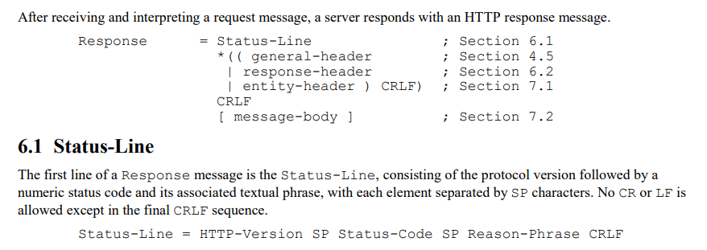

[TOC]

### 实验1-用集中写发送HTTP响应

#### 基本

- Tom在端口`11111`启动`sendfile_service`服务，但不进行合法的HTTP应答时
  - （1）无法直接从Chrome访问`<ip>:<port>`获取文件，看F12，请求被canceled
  - （2）Windows上`curl <ip>:<port>`也会提示`curl: (1) Received HTTP/0.9 when not allowed`
  - （3）Jerry上`wget <ip>:<port>`能获取成功，显示`...200 No headers, assuming HTTP/0.9`，能把文件拉下来
  - （4）Jerry上`telnet <ip> <port>`能成功显示文件内容
  - 通过**对比telnet和curl和chrome访问的tcpdump结果**发现数据已经传输并被确认，符合（3）、（4），但是telnet时是Tom主动发送FIN，其他三种都是客户端会主动发送FIN然后Tom响应Reset。


#### 代码

- 服务端：`respond_http.cc`
- 客户端：Window上Chrome访问或curl、Ubunut上telnet或wget，`<command> <ip>:<port>`


#### <span style="color:red">思考题</span>

##### Q1：有无内核空间的`writev()`？（jyy：你想到别人肯定想过）


##### Q2：如何知道HTTP报文格式约定？

描述：最容易谷歌出来的是Mozilla HTTP Messages，为什么？mozilla的文档是不是官方的？如何知道行之间的分割符是`\r\n`？

- 官方文档应该是RFC 2616（HTTP/1.1），应该学会查RFC：
  - WEB：https://datatracker.ietf.org/doc
  - PDF：https://www.rfc-editor.org
- RFC 2616的2.2和6，说得简单明了：
  - `2.2`：HTTP/1.1以CRLF作为除entity-body部分的行尾标记
  - `6`：
- 


### 实验2-用状态机解析HTTP请求

#### 基本

- 尝试状态机写法，维护`报文处理状态机`和`行处理状态机`，但依旧有很多问题
  - 关于**状态转移**：状态转移是否应该集中在一个函数？如果是，保证做到的原则/设计是？比如`报文处理状态机`的result（对一次recv的处理结果）改变，check_stat（对报文所处处理环节）的改变可以比较集中）？
  - 关于**接收缓存**：buf如何复用？`CheckOneLine()`对buf造成了破坏，能不能破坏？能不能不要破坏？
  - 关于**与TCP状态机**的联系：二者有联系吗？如果有，TCP状态机如何体现在这里？
  - **暂用struct代替了class，"全局变量"放入struct，是否有更好方式？**


#### 代码

- 接收端：`handle_http_request.cc`
- 发送端：Chrome/wget/curl。
- telnet会卡住，能不能提示？卡在recv了？
- `webbench -t 10 -c 5 <uri>`压测结果
```
divsigma@tom:~/webbench-1.5$ webbench -t 10 -c 5 http://192.168.56.2:11111/
Webbench - Simple Web Benchmark 1.5
Copyright (c) Radim Kolar 1997-2004, GPL Open Source Software.

Benchmarking: GET http://192.168.56.2:11111/
5 clients, running 10 sec.
force == 0, errno=4
Correcting failed by signal
force == 0, errno=4
force == 0, errno=4
force == 0, errno=4
force == 0, errno=4
Correcting failed by signal
Correcting failed by signal
Correcting failed by signal
Correcting failed by signal

[1]
Speed=54828 pages/min, 60310 bytes/sec.
Requests: 9138 susceed, 0 failed.
...
[2]
Speed=40044 pages/min, 44048 bytes/sec.
Requests: 6674 susceed, 0 failed.
...
[3]
Speed=49842 pages/min, 54826 bytes/sec.
Requests: 8307 susceed, 0 failed.
...
[4]
Speed=51606 pages/min, 56766 bytes/sec.
Requests: 8601 susceed, 0 failed.
...
[5]
Speed=51210 pages/min, 56337 bytes/sec.
Requests: 8535 susceed, 0 failed.

```


#### <span style="color:red">思考题</span>

##### Q1：把HTTP报文当字符串处理是最好的选择吗？是最直观的选择吗？

描述：Mozilla说

> HTTP messages are composed of textual information encoded in ASCII

但未找到RFC中有相关明确指示（http族的RFC：https://datatracker.ietf.org/group/http/documents/）


##### Q2：局部const生命周期是怎样的？（见`RESULT_CODE ParseReqLine(const char*)`）


##### Q3：`printf`的`%.*s`本质上有没有进行`strncpy()`或`memcpy()`？

描述：尝试用`printf`输出字符串的特定长度时有疑问（https://stackoverflow.com/questions/7780809/is-it-possible-to-print-out-only-a-certain-section-of-a-c-string-without-making）


### 实验3-用poll实现简易群聊

#### 基本

- 对socketfd的`send()`和`recv()`，似乎都可以是默认的设置（即阻塞）。根据`man poll`，`poll()`也是阻塞的，其中NOTES有一句话<span style="color:red">待理解</span>

> The operation of poll() and ppoll() is not affected by the O_NONBLOCK flag.

- `poll()`所用的pollfd集合用数组维护，`元素增减`与`检查poll返回时各pollfd状态的过程`耦合了。而且删除本质为替换，需要在`poll(kFDS, 1 + kCntClient, -1)`中用实际个数限制有效的kFDS长度。否则关闭后的socket依旧会返回（<span style="color:red">有无方式避免？待确认已关闭socketfd此时的revents状态</span>）

  关于poll的返回

> If none of the events requested (and no **error**) has occurred for any of the file descriptors, then poll() blocks until **one of the events occurs**

- 牺牲大量空间换时间：目前用桶哈希维护接入的socketfd到其buffer的映射
  - <span style="color:red">可以尝试STL set吗？</span>
- **尽量不要一次性写超过20行的未测试代码**，这次编码中模块化/阶段性测试帮到我很多


#### 代码

- 服务端：`group_chat_service.cc`
- 客户端：`telnet`（可以尝试自己用poll造一个）


#### <span style="color:red">思考题</span>

##### Q1：结构体复制是值复制还是指针复制？

描述：代码中用到了结构体的赋值，能否避免？（https://stackoverflow.com/questions/2302351/assign-one-struct-to-another-in-c）


##### Q2：为什么监听的socket是SOCK_STREAM，`accept`的socket要设置成non-blocking？


##### Q3：为什么要先处理HUP、ERR，最后处理POLLIN，定义拦截顺序是否合理？能否使独立？

描述：peer_sock关闭后，服务器端的socket似乎会同时触发POLLIN和POLLRDHUP，需要在进入POLLIN前将处理拦截在POLLRDHUP。如果进入了POLLIN进行recv()，会返回0（BLOCKING。NONBLOCK好像不生效？）


##### Q4：书中代码为什么每次都在POLLIN和POLLOUT中修改所有客户socket pollfd的`events`？


### 实验4-尝试将信号统一为IO（通过IO-Multiplexing统一事件源）

#### 基本

- 利用双工管道`socketpair`。（跟`pipe`的效率对比？关系？适用场景？）

- `man poll`中何时返回EINTR：对阻塞的系统调用（blocked system call），在没有阻塞返回前收到信号，会返回errno=4，需要在poll返回值作过滤
  - https://unix.stackexchange.com/questions/509375/what-is-interrupted-system-call
- 样例中，socketpair是阻塞的，`sigaction()`亦未设置`SA_RESTART`，依旧可以捕获SIGTERM后继续运行。`SA_RESTART`值非0。（`sigaction()`的`signum`不允许SIGKILL和SIGSTOP参数）


#### 代码

- `group_chat_service_sio.cc`
  - 在`group_chat_service.cc`基础上：（1）注册信号处理函数（2）poll监听信号IO的socketpair（3）写信号事件（信号处理函数）（4）读信号事件并处理
  - 核心增加＜30行，信号处理函数非可重入的。


#### <span style="color:red">思考题</span>

##### Q1：`SA_RESTART`的作用？


##### Q2：如果用pipe替代socketpair，是不是需要将写端改为非阻塞？


##### Q3：除了SIGKILL，没有其他更高的杀死进程的方法了？有无办法让程序接收到SIGKILL后RESTART


### 实验5-定时器demo

#### 基本

- 目前仅实现了升序链表计时器（书中提及的时间轮和时间堆似乎偏向数据结构，后期考虑）
- IO复用统一了定时处理（统一事件源），所以加定时组件应该不需要对main loop作太多修改，关键是做好**模块测试**。**不要着急一次性写太多代码（目前是20行）**。


#### 代码

- 升序链表定时器类及其函数实现、Client结构体、：`client_timer_list.h`
- 服务端：`timing_group_chat_service.cc`
  - 在`group_chat_service_sio.cc`基础上添加：（1）`alarm()`系统调用，定时触发SIGALRM；（2）SIGALRM处理中清理不活跃客户的套接字和定时器；（3）客户发消息后重置定时器；（4）客户退出后清理定时器
- 升序链表定时器类的测试代码：
  - 定时器随机增删改：`test_client_timer_list.cc`
  - 定时器随机增与批量删：`test_timer_tickonce.cc`


#### <span style="color:red">思考题</span>

##### Q1：相对事件？


##### Q2：防止内存泄漏（除了容易delete外，new和delete的缺点？）


##### Q3：`kClient`、`kFDS`、`ClientTimer`、`kClientTimerList`似乎耦合严重，如何整理模块绑定与逻辑？


